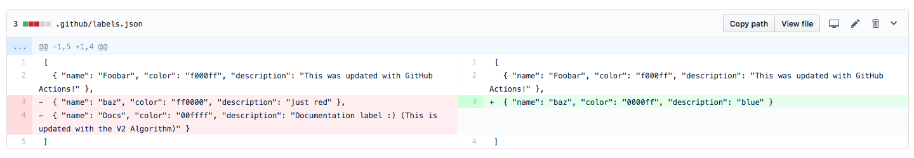
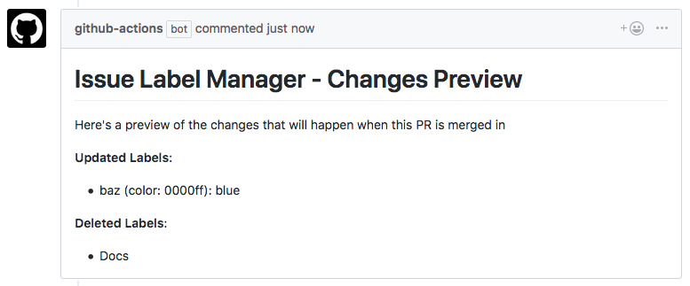

# Issue Label PR Comment Action

Preview changes of the [Issue Label Manager Action](https://github.com/lannonbr/issue-label-manager-action) when making PRs.

So If I make a change to a `.github/labels.json` file like the following and push it in a Pull Request:



When using this action in the repo, it will generate a comment in the PR as such:



## Usage

```workflow
action "Preview Issue Label Changes" {
  uses = "lannonbr/issue-label-pr-comment-action@1.0.0"
  secrets = ["GITHUB_TOKEN"]
}
```

This action requires the `GITHUB_TOKEN` secret so it has access to make comments in a PR on your behalf.
